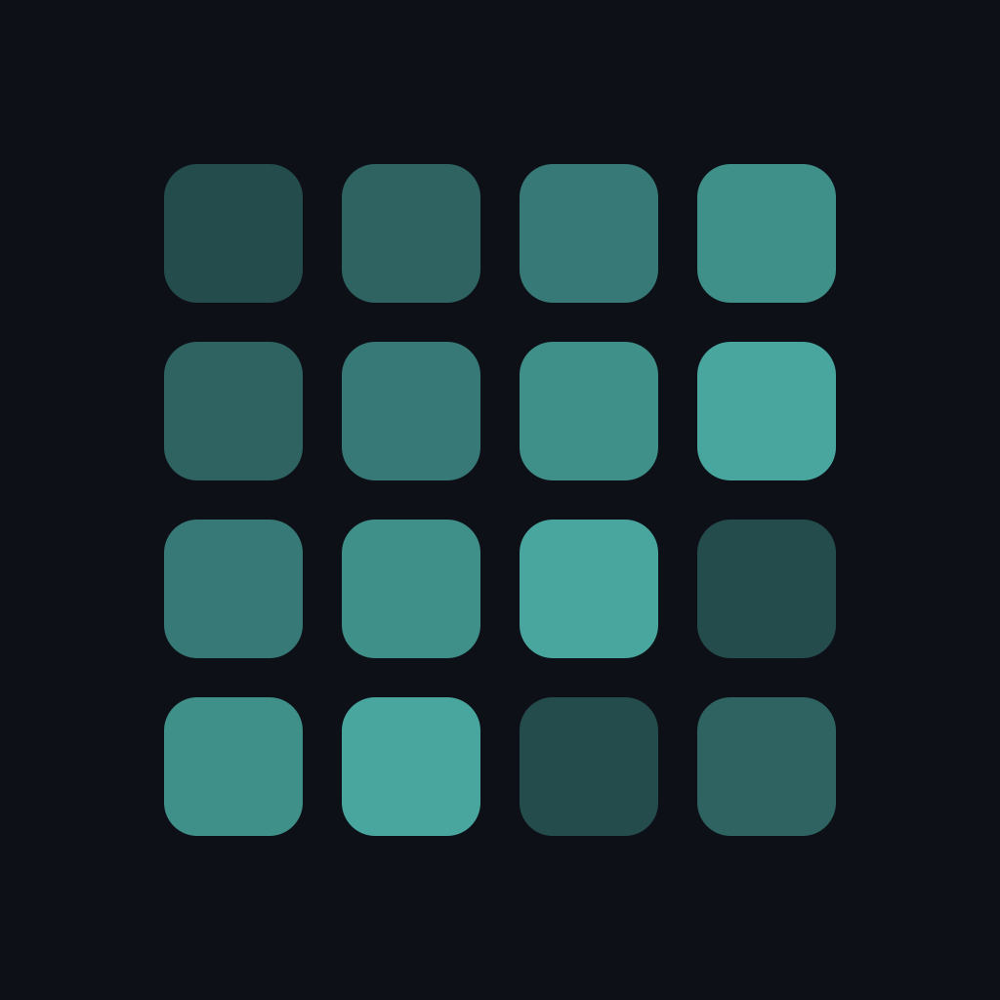

<div align="center">



# Sequence

### Track habits the way GitHub tracks code — a living visual record of consistency.

[](https://www.apple.com/ios/)
[](https://swift.org)
[](https://developer.apple.com/xcode/swiftui/)
[](https://developer.apple.com/xcode/swiftdata/)
[](LICENSE)
[](#)

<br />

</div>

---

Every day you show up is a square. Every square fills in. Over weeks and months, the grid becomes an honest, at-a-glance picture of who you've been — and a reason to keep going.

Sequence turns your habits into a **GitHub-style contribution graph**. No streaks to fake. No badges to chase. Just the truth, rendered in color.

## ✨ Features

- 📊 **Contribution graph per habit** — a week-aligned grid with a 5-level intensity scale. The deeper the color, the harder you worked. Empty squares don't lie.
- 🎯 **Three habit types** — binary (did / didn't), counted (e.g. 50 reps), and timed (e.g. 30 min) with a built-in stopwatch.
- 🔥 **Streaks that mean something** — current and best streaks with a configurable intensity threshold, plus a gentle `0d (was 5d)` treatment when a chain breaks.
- ✅ **Daily tasks** — a lightweight task board with templates, automatic roll-over of unfinished items, and a **Perfect Day** ring when you clear everything.
- 📈 **Stats** — momentum score, a seriousness gauge, per-habit breakdowns, and a shareable **Year in Sequence** review card.
- 🔔 **Smart notifications** — habit reminders, streak-at-risk alerts, a morning task summary, milestone celebrations, quiet hours, and rich **Log now / Snooze** actions. Background refresh keeps everything current.
- 🎨 **Make it yours** — light / dark / system appearance, 18-colour custom palettes, week-start and graph-direction preferences, and full JSON data export.
- 🚀 **Considered onboarding** — an animated splash, a five-screen intro that creates your first habit, and one-time coach marks so nothing is confusing twice.

## 🎨 Design

Sequence is built on a real design system — not hardcoded values scattered through views:

- **Tokens, not magic numbers** — all color, type, spacing, and radius live in `SequenceColor`, `Typography`, and `Spacing`. No raw hex in views.
- **Motion with intent** — three custom spring curves (`.sequenceStructural`, `.sequenceMicro`, `.sequenceFluid`) for interactive change; never `.easeInOut` or `.linear`.
- **Local-first** — all data stays on device via SwiftData. No accounts, no servers, no subscriptions.

## 🧠 How it works

```
Sequence/
├── App/            Entry point, launch router (splash → onboarding → main)
├── DesignSystem/   Color tokens, typography, spacing, springs, shared components
├── Models/         SwiftData @Models — Habit, HabitLog, DailyTask + enums
├── Data/           SequenceRepository + pure engines:
│                   Intensity · Streak · Stats · ColorScale · ContributionGraphBuilder
├── Notifications/  NotificationManager + BackgroundTaskManager
└── Features/       Today · Tasks · Stats · Settings · Onboarding
```

The data layer splits into an `@Observable SequenceRepository` (CRUD + persistence) and a set of **pure, stateless engines** that compute intensity levels, streaks, and statistics — keeping business rules unit-testable in isolation.

## 📦 Getting started

**Requirements:** Xcode 16+, [XcodeGen](https://github.com/yonaskolb/XcodeGen) (`brew install xcodegen`), an iOS 17+ simulator.

The Xcode project is generated from `project.yml` — `*.xcodeproj` is gitignored.

```bash
git clone https://github.com/23aneessss/Sequence && cd Sequence
make run        # generate project, build, and launch on simulator
```

Other commands:

```bash
make test       # run the unit-test suite
make fresh      # clean install — wipes data, re-shows onboarding
make help       # list all commands
```

Different simulator? `make run SIMULATOR="iPhone 16 Pro"`

<details>
<summary>Without the Makefile</summary>

```bash
xcodegen generate
xcodebuild -project Sequence.xcodeproj -scheme Sequence \
  -destination 'platform=iOS Simulator,name=iPhone 16 Pro' build
```

</details>

## 🛠 Tech stack

| Layer | Technology |
|---|---|
| UI | SwiftUI · `@Observable` · `matchedGeometryEffect` |
| Persistence | SwiftData (`@Model`, `ModelContainer`) |
| Notifications | `UNUserNotificationCenter` · `BGAppRefreshTask` |
| Project gen | XcodeGen (`project.yml`) |
| Min target | iOS 17 |

## 🗺️ Roadmap

- [ ] App Store release
- [ ] Widgets (Today summary, streak at a glance)
- [ ] iCloud sync across devices
- [ ] Apple Watch companion
- [ ] Habit templates library
- [ ] Advanced stats (correlation between habits, best-day analysis)
- [ ] Localization (FR included)

## 🤝 Contributing

Issues and PRs are welcome. The project is generated with XcodeGen — edit `project.yml` and run `xcodegen generate` after adding or removing files.

## 📄 License

[MIT](LICENSE) — free to use, fork, and build on.

<div align="center">
<br />
<sub>Built with SwiftUI · Don't break the chain.</sub>
</div>
